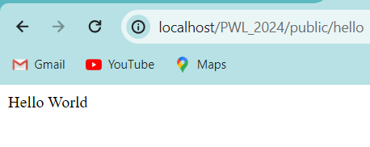
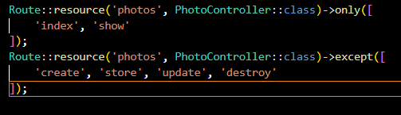
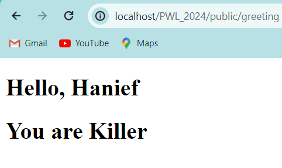
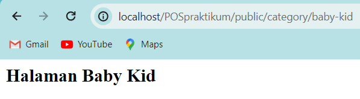

# JOBSHEET-02-WEB-LANJUT

## NAMA : Hanief Mochsin

## ABSEN : 15

## KELAS : TI-2F

-pengerjaan laporan jobsheet web lanjut lewat github

### Praktikum Pertama

-"Route::get('/hello')" untuk menampilkan string hello ke browser dalam bentuk URL bagian akhir.

-Kode tersebut mendefinisikan sebuah route yang mengembalikan string World ketika user mengunjungi URL /world dengan method GET sama seperti URL /hello sebelumnya.

-route URL "/" untuk menampilkan string "Selamat Datang".

-route URL "/About" untuk menampilkan string "NIM dan Nama saya".

### Praktikum Selanjutnya

-route URL {nama} sebagai parameter function ($name) lalu akan di return di dalam function nya dengan memanggil parameter.

-URL localhost/PWL_2024/public/user/ menghasilkan 404 not found karena tidak sesuai dengan pendefinisian pada route yang mengharuskan menggunakan parameter nama atau string.

-URL menggunakan route yang sudah didefinisikan dalam kode untuk menampilkan string yang berisi nilai dari parameter postId dan commentId.

-route URL {name?} dengan memberikan tanda tanyan pada kode tersebut mengartikan bahwa URL name nya menjadi bersifat opsional. parameter function ($name=null) apabila URL name nya dikosong akan di printkan sesuai isi dari function dengan isi parameter name tetap null atau kosong.

-selanjutnya hanya mengubah parameter yang tadinya default nya null sekarang di isi 'John'. jadi, apabila URL name tidak di isi atau kosong maka akan diprintkan sesuai dengan default parameter yang telah diubah tadi.

### Praktikum Selanjutnya

-URL /hello memanggil WelcomeController dengan class hello lalu print value class hello.

-membuat controller

-pengubahan route agar terhubung dengan controller

-Home controller

-about controller

-article controller

### Praktikum Selanjutnya

-generate photocontroller

-route list

-update controller

-hasil run dari view hello dari route dengan URL /greeting. jadi, dari view kita bsia membuat kode template untuk di inisiasi di route dengan URL tertentu dan value fungsi sesuai ketentuan

-hasil nya sama seperti sebelumnya, akan tetapi bedanya berada di function nya yang dipindahkan ke welcomecontroller jadi route hanya menginisiasi dari welcome controller untuk di print

-menambahkan occupation pada view, tidak jauh beda dengan sebelumnya hanya saja menambahkan satu variabel untuk diteruskan ke view

##TUGAS PRAKTIKUM POS

-home:

-kategory :

-1.babykid:

-2.foodbeverage:

-3.homecare:

-4.beautyhealth:

-halaman user:

-halaman penjualan:

